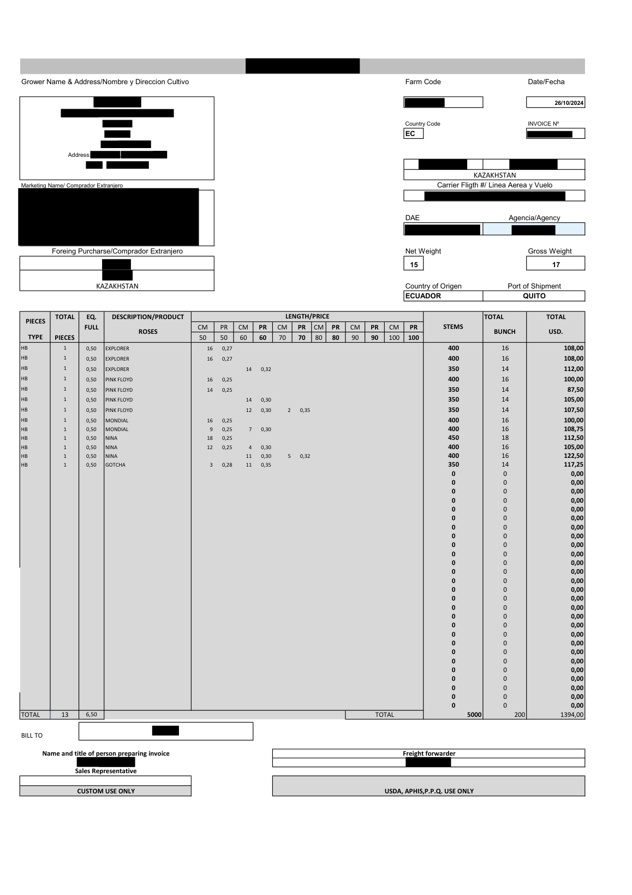
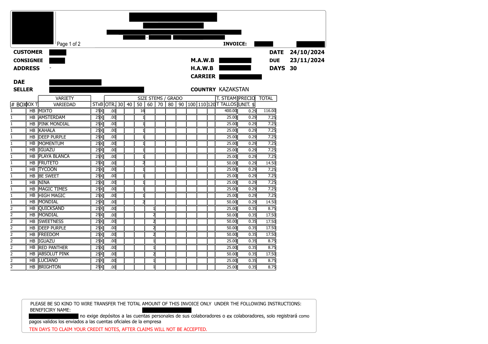
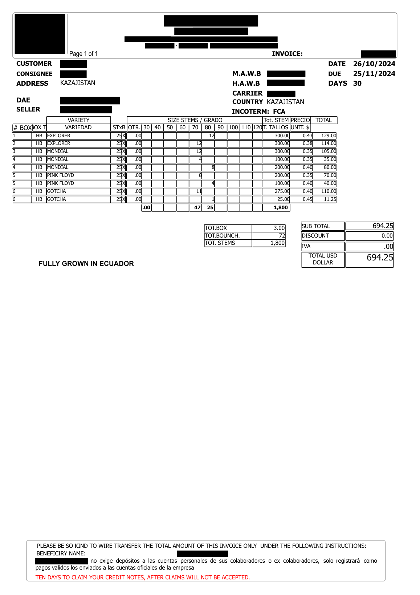
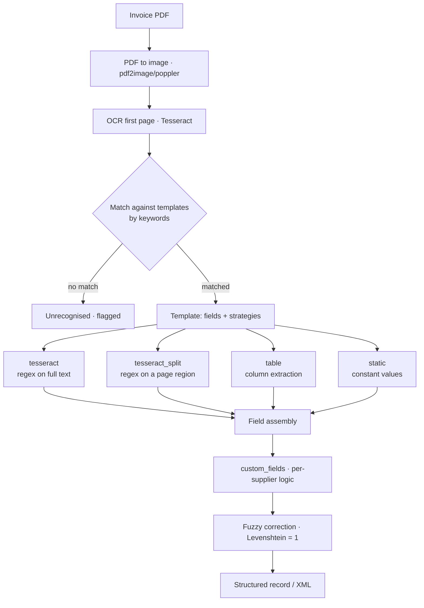

<div align="center">

# 🧾 Invoice OCR Framework

**A template-driven OCR pipeline that turns supplier invoice PDFs into structured data — match any supplier's layout with a declarative JSON config, no new parser code.**

[](https://www.python.org/)
[](https://github.com/tesseract-ocr/tesseract)
[](#-quick-start)
[](LICENSE)


</div>

---

> 📅 **Project timeline.** The production system this is extracted from was built between **August 2024 and January 2025** (most of the work in September–October 2024). It is **no longer under active development**; this repository is an anonymised archive of the engine.

## 🎯 The problem

An importer receives invoices from **dozens of different suppliers** as PDF attachments. Every supplier uses its own layout: different field names, different positions, different table structures — and many are scanned rather than digital.

Someone then opens each PDF and **retypes the data into an ERP** by hand: invoice number, air waybill, dates, box counts, line items, weights. It's dozens of documents a day, it's slow, and one mistyped number propagates into accounting and customs paperwork.

Writing a bespoke parser per supplier doesn't scale either — you end up with dozens of near-identical scripts that all drift apart.

## 💡 The approach

**Describe each supplier declaratively, parse them all with one engine.**

A supplier is just a folder with a JSON file that says *how to recognise this invoice* and *where each field lives*. Adding a supplier means writing a config — not code.

```
PDF → OCR first page → match template by keywords → extract fields
    → per-supplier custom logic → fuzzy-correct names → structured output
```

> ℹ️ This repository is an **anonymised extraction of a production system** that ran against dozens of real suppliers. The engine is the real thing; the supplier templates here are **fictional samples** written for the demo.

## 📄 Why templates: every supplier looks different

This is the whole problem in one picture. Three invoices, three completely different layouts — different field labels, different positions, different table shapes, two languages. A single regex set cannot read all of them; a template per supplier can.

<div align="center">

| Form-style layout | Dense table layout | Compact layout |
|:---:|:---:|:---:|
|  |  |  |
| Boxed header, grid of size/price columns | Header block + long line-item table | Short table with a totals panel |

</div>

> 🔒 **Real invoices, fully redacted.** Every identifying detail — supplier, buyer, people, addresses, phones, emails, tax IDs, AWB/DAE numbers, bank details and logos — has been **removed from the PDF itself** (true redaction, not an overlay) before rendering. What remains is exactly what matters here: the *structure* each template has to cope with.

Notice what stays constant across all three: there is always an invoice number, a date, an air-waybill, a consignee, and a table of line items. That shared skeleton is what the field names in a template map onto — while `keywords`, regexes and `split_coordinates` absorb the differences.

## 🏗️ How it works



## 🧩 The template system

Each supplier lives in `templates/<supplier>/` and is defined by a JSON file:

```jsonc
{
  "name": "Rosa Verde Invoice (sample)",
  // strings that appear ONLY on this supplier's paper
  "keywords": ["ROSA VERDE S.A.", "info@rosaverde.example"],
  // where to cut the page for region-specific OCR
  "split_coordinates": [0.45],
  "non_fields": ["TOTAL", "SUBTOTAL"],
  "fields": {
    "tesseract": {                      // regex over the whole page text
      "INVOICE_NUMBER":   "CUSTOMER INVOICE\\s*(\\d+)",
      "HAWB":             "HAWB\\s*([A-Z0-9]+)",
      "BOX_PLACES_COUNT": "TOTAL BOXES\\s*([\\d.]+)"
    },
    "tesseract_split": {                // regex over a cropped region only
      "INVOICE_DATE": "Invoice\\s*Date\\s*(\\d{2}/\\d{2}/\\d{4})",
      "AVIA_TICKET":  "MAWB\\s*([\\d -]+)"
    }
  }
}
```

`InvoiceTemplate.match()` checks whether any keyword appears in the OCR'd text — which is why keywords should be things unique to that supplier (legal entity name, their email address).

### Why four parsing strategies

A single regex pass over a whole page is not enough for real invoices, so **each field declares how it should be read**:

| Strategy | Use it when |
|---|---|
| **`tesseract`** | The value is unique on the page — match it anywhere |
| **`tesseract_split`** | The same pattern appears several times (dates, numbers) — crop the page at `split_coordinates` and search only that region |
| **`table`** | Line items — extract a real table by its column headers |
| **`static`** | The value is constant for that supplier — don't read it at all |

### Per-supplier custom logic

If a template folder contains a `.py` next to its `.json`, the loader imports it and calls `custom_fields()` after extraction — for everything a regex can't express. See [`templates/valle_flores/valle_flores.py`](templates/valle_flores/valle_flores.py):

```python
def custom_fields(extracted_data: dict) -> dict:
    # normalise date, derive arrival date (+5 days lead time)
    # zero-pad the invoice number to 6 digits
    # derive gross weight = 25 kg × box count
    return extracted_data
```

## 🔤 Fixing OCR mistakes

OCR on scanned invoices routinely garbles product names. Instead of failing, every extracted name is looked up in a reference dictionary using **Levenshtein distance**:

```python
for key in translate_dict:
    if distance(name, key) == 1:      # exactly one character off
        return translate_dict[key]     # corrected + localised
```

Exact match → used directly. One character off → corrected. Anything further → passed through and **logged**, so unknown names surface loudly instead of silently corrupting data.

## 📁 Project structure

```
invoice-ocr-framework/
├── main.py                     # parse a single PDF
├── core/
│   ├── invoice_template.py     # InvoiceTemplate: keywords, fields, split, custom module
│   └── invoice_parser.py       # orchestrator: OCR → match → extract → correct
├── parsers/
│   ├── tesseract_parser.py         # regex over full page text
│   ├── tesseract_split_parser.py   # regex over cropped regions
│   ├── table_parser.py             # column-based table extraction
│   └── static_parser.py            # constant values
├── templates/                  # one folder per supplier (JSON + optional .py)
│   ├── rosa_verde/                 # sample: simple regex fields
│   ├── andes_blooms/               # sample: with a line-item table
│   └── valle_flores/               # sample: with a custom module
├── utils/
│   ├── utils.py                # template loading, mailbox polling, XML building
│   ├── table_functions.py      # table extraction helpers
│   └── translate.py            # reference dictionaries (sample)
└── config/                     # OAuth credentials for the email mode (not committed)
```

## 🚀 Quick Start

```bash
git clone https://github.com/simeonkolchin/invoice-ocr-framework.git
cd invoice-ocr-framework

pip install -r requirements.txt
# system packages required: tesseract-ocr, poppler-utils

python main.py path/to/invoice.pdf
```

Or with Docker (Tesseract and poppler are baked in):

```bash
docker build -t invoice-ocr .
docker run --rm -v "$PWD:/data" invoice-ocr python main.py /data/invoice.pdf
```

## 📮 Email-driven mode

`utils/utils.py` also ships the automation layer the production system used: poll a mailbox over IMAP, pull PDF attachments from new messages, run them through the pipeline, and upload results to cloud storage — wrapped in a restart loop so one malformed PDF never stops the queue.

All credentials come from the environment:

| Variable | Purpose |
|---|---|
| `GOOGLE_CLIENT_SECRET_FILE` | OAuth client JSON (default `config/client.json`) |
| `GOOGLE_TOKEN_FILE` | Generated token (default `config/token.json`) |
| `TEMPLATE_DIR` | Where templates live (default `templates`) |

## ➕ Adding a supplier

1. Create `templates/<supplier>/`
2. Add `<supplier>.json` — keywords that uniquely identify the invoice, plus field regexes per strategy
3. If it needs derived or reformatted values, add `<supplier>.py` with `custom_fields()`
4. Run `python main.py sample.pdf` and iterate on the regexes

**No changes to the engine are required.**

## 👥 Authors

- [**Simeon Kolchin**](https://github.com/simeonkolchin)
- [**Dmitriy Kutsenko**](https://github.com/kdimon15)

## 📄 License

MIT © [Simeon Kolchin](https://github.com/simeonkolchin) & [Dmitriy Kutsenko](https://github.com/kdimon15)
